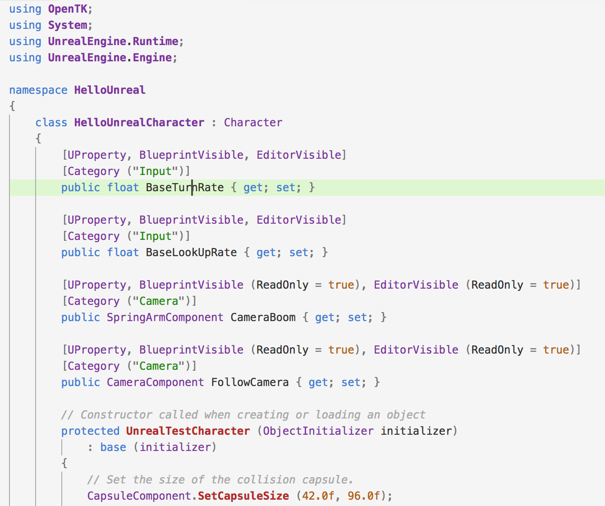

## Features

* Fully integrated with the Unreal object system and Unreal Editor.
* C# bindings are generated automatically for all Blueprint-accessible types and members.
* Objects and functions defined from C# can subclass types defined in C++, and can be used from Blueprint and from the Unreal Editor.
* Runs on Windows and Mac.

Planned or in development:

* Visual Studio integration
* Debugging
* Hot reload
* Mobile platform support
* Cooked builds

Feature requests and and bugs are tracked using [GitHub Issues](https://github.com/mono-ue/UnrealEngine/issues). 

## Installation

The plugin is currently available only as source, as it requires a patched build of the engine.

You will need [source access to Unreal Engine on GitHub](https://www.unrealengine.com/ue4-on-github) to get access to the MonoUE fork.

1. Clone the [mono-ue/UnrealEngine](https://github.com/mono-ue/UnrealEngine) fork of Unreal Engine
2. Check out the [monoue-4.16](https://github.com/xamarin/UnrealEngine/tree/monoue-4.16) branch
3. Follow the instructions in the [Engine/Plugins/MonoUE/README.md](https://github.com/mono-ue/UnrealEngine/blob/monoue-4.16/Engine/Plugins/MonoUE/README.md).

## License

The plugin has been developed with the support of Microsoft, but is currently a personal side project of several Microsoft employees. It is not officially supported by either Microsoft or Epic. It is being made freely available as source to all Unreal Engine licensees in the hope that the community considers it useful and participates in its development.

**This code is provided by Microsoft "as is" with no warranty**.

For details, see [LICENSE.md](https://github.com/mono-ue/UnrealEngine/blob/monoue-4.16/Engine/Plugins/MonoUE/LICENSE.txt) in the plugin directory.

## Contact

For questions and discussion, please use the [mono-ue mailing list](https://lists.dot.net/mailman/listinfo/mono-ue).

The primary contact for the project is [Mikayla Hutchinson](https://github.com/mhutch) ([@mjhutchinson](https://twitter.com/mjhutchinson)).
